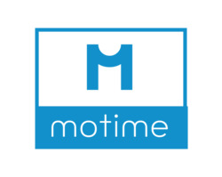

MotiMe is a motivational quote web app.

Deployment/Sign-up Link: http://bit.ly/38UAqGe

## Summary

- MotiMe aggregates quotes from 3 sources, 1) Twitter API, 2) RapidApi, 3) web scraping from 2 separate websites. The app then sends quotes to users using the Twilio API and accepts a response message with the users vote on whether they like the quote or not. On the backend, these quotes are stored in a database (Postgres for development, DynamoDB in production) along with a few generated feature columns such as author, num of unique words, length of quote, and quote category. In order to predict the quote category, I have trained a ML/DL model on labelled quotes, and then run a prediction on new incoming quotes predicting the category from a list of 5 pre-defined classes and save that metric to the database. This application is then run on a scheduler periodically sending quotes to the users and accepting their feedback through SMS.
- Quote CSV ML/DL preparations: The original quote database was downloaded from the web with 75,961 quotes and 117 categories. I dropped half of the quote categories and performed data cleaning, ending with 42,030 quotes and 57 categories. Afterwards, I reduced the 57 to 5 categories by grouping similar categories under one heading. Afterwards, I used sampling to upsample the classes with less records, and downsample the classes with too many records balancing the categories to the average amount of samples resulting in a dataframe with 35,958 quotes across 5 categories. All Ml/Dl models where ran on this balanced and cleaned dataset.
- Frontend: For the frontend I have deployed a Flask app with Auth0 for user authentication. The user is able to log in or register and once authenticated will see a table displaying all of the quotes, they have received along with the votes they've submitted.

### Development specific  

- In development, the model used is a custom CNN based on the Paper ["Convolutional Neural Networks for Sentence Classification"](https://arxiv.org/abs/1408.5882) by Yoon Kim. There is also the option to predict using two other options, a basic LSTM and an LSTM with an Attention Layer.
- In development, the database in use is PostgreSQL, and there is a H2O Wave dashboard that display's the quotes saved in the DynamoDB.
- Webhook routing for Twilio is handled through Ngrok during development. And user authentication is handling through Flask Login.  

### Production specific

- In production, the model used for classification is Sklearn's Linear Support Vector Classification. The model is saved as a .pkl and uploaded to AWS, dependencies on S3, function on lambda and inference through API Gateway.
- User authentication is handled with Auth0, using a modified Auth0 signup page to fetch additional user details such as phone number and name. The application reads users information from Auth0 and sends Twilio SMS to their registered phone numbers. For each quote, the model calls the prediction API using requests by passing it the payload of the selected quote.
- Function scheduling is handled using AWS's state machine functionality defined through yaml.

## Technologies

### Tech Stack

- Python
- Flask
- Simple frontend - HTML / CSS / Jinja2 / JavaScript
- Twilio API
- Twitter API
- RapidApi
- BeautifulSoup
- JSON
- Yaml

#### Development specific
- PostgreSQL
- SQLAlchemy
- H2O Wave (for experimentation)
- Ngrok

##### ML/DL
- Pytorch
- Transformers

#### Production specific

##### AWS

- Auth0 (user authentication, sign-up and log-in)
- DynamoDB (NoSQL - modified as an adjacency map to mimic many-to-many relationships)
- Lambda
- API Gateway (for Twilio webhook)
- State Machine (for function workflow and scheduler)
- Elastic Beanstalk (for frontend, integrated with CI/CD using Cloud Pipeline to push git changes to deployment automatically)
- CloudFormation (for cloud infrastructure management)

##### ML

- Sklearn

## Potential New Features

- ~~Upgraded sign-in, sign-up and homepage frontend experience.~~
- ~~Deployed version of quote dashboard for each user to see the quotes they've received~~
- Once critical mass is achieved, deploy a binary classification model which will predict whether a specific user would like an incoming quote. if yes, send the user that quote, otherwise fetch a new one.
- Deploy larger DL Pytorch and Transformers classification model to AWS.
